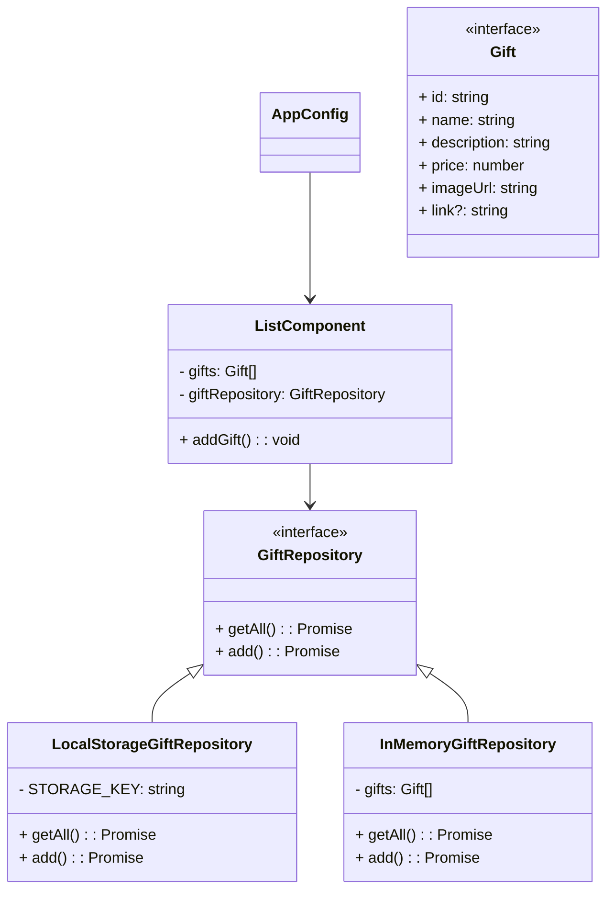

# list

This library was generated with [Nx](https://nx.dev).

## Running unit tests

Run `nx test list` to execute the unit tests.

## Mermaid diagram

```mermaid

classDiagram

  direction TB

  
  
  class AppConfig {
    
  }

  class ListComponent {
    - gifts: Gift[]
    - giftRepository: GiftRepository
    + addGift(): void
  }

  class GiftRepository {
    <<interface>>
    + getAll(): Promise<Gift[]>
    + add(): Promise<void>
  }

  class LocalStorageGiftRepository {
    - STORAGE_KEY: string
    + getAll(): Promise<Gift[]>
    + add(): Promise<void>
  }

 class InMemoryGiftRepository {
    - gifts: Gift[]
    + getAll(): Promise<Gift[]>
    + add(): Promise<void>
  }

  class Gift {
    <<interface>>
    + id: string
    + name: string
    + description: string
    + price: number
    + imageUrl: string
    + link?: string
  }

    AppConfig --> ListComponent
%%    AppConfig --> GiftRepository
%%  AppConfig --> LocalStorageGiftRepository
%%    AppConfig --> InMemoryGiftRepository
    
  
    ListComponent --> GiftRepository
    GiftRepository <|-- LocalStorageGiftRepository
    GiftRepository <|-- InMemoryGiftRepository

 

```
